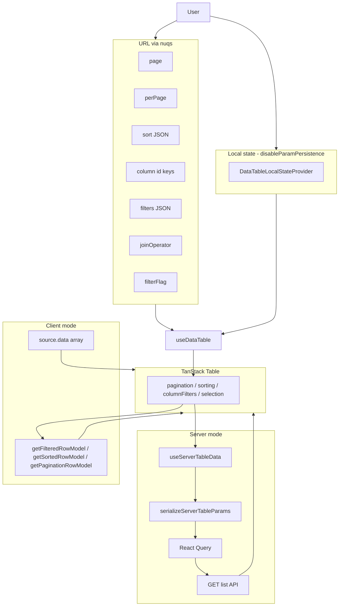

# DataTable architecture

## High-level modes



## `<DataTable />` internal wiring

1. **`disableParamPersistence === false`** (default): `DataTableCore` reads/writes URL via `useDataTable` + `useServerTableData`.
2. **`disableParamPersistence === true`**: wraps `DataTableLocalStateProvider`; same hooks read local state instead of URL.
3. **`source.type === "server"`**: `useServerTableData` runs; `manualPagination/Sorting/Filtering: true`; `pageCount` from API.
4. **`source.type === "client"`**: `data` prop drives rows; TanStack client row models apply filter/sort/page in-browser; `pageCount` is `-1` (internal).

## Simple vs advanced filters

| | Simple toolbar | Advanced toolbar |
|--|----------------|------------------|
| **Enable on page** | `enableToolbar` | `enableToolbar` + `enableAdvancedFilter` |
| **Active when** | `filterFlag` absent or not `advancedFilters` | User toggles advanced OR URL already has `filters` |
| **URL** | Per-column keys (`?email=foo`, multi: `?status=a,b`) | `filterFlag=advancedFilters`, `filters=[...]`, `joinOperator` |
| **Serialized to API** | `columnFilters` JSON | `filters` JSON + `filterFlag` |
| **Toolbar component** | `DataTableToolbar` | `DataTableAdvancedToolbar` + `DataTableFilterList` |
| **Column filters in TanStack** | Populated from URL column keys | Empty in URL mode; advanced state separate |

`useTableAdvancedOptions()` (inside `DataTable`) computes `effectiveAdvancedFilter = enableAdvancedFilter && (filterFlag === advancedFilters || hasUrlFilters)`.

## Server fetch pipeline

```
URL/local state
  → useServerTableData builds ServerTableState
  → serializeServerTableParams(state) → Record<string, string>
  → React Query queryKey includes JSON.stringify(params)
  → fetch(params) → axios GET
  → { data: T[], pagination: { pageCount, total?, page?, perPage? } }
  → table.setPageCount / rows rendered
```

**Critical:** `fetch` is typed as `(state: ServerTableState) => ...` but **receives serialized params** at runtime. Always `params` → API unchanged.

## Columns pipeline

```
GET /columns
  → useBackendColumns (optional filterBy refetch)
  → convertBackendColumns
  → merge overrideColumns / prepend / append
  → DataTable columns prop
```

`columnVisibility` from backend (`hidden: true` → `false` in map) must be passed to `initialState.columnVisibility`.

## Composition escape hatch

For layouts that do not fit `<DataTable />`:

```tsx
const { table } = useDataTable({ data, columns, serverSide: true, pageCount });
const server = useServerTableData({ fetch, queryKey, columns, ... });
// Render DataTableToolbar, DataTableContent, DataTablePagination manually
```

Exported from `@workspace/flowtrove/components/datatable`.

## Backend contract

Every serialized param must be parsed by `datatable.ExtractQuery` in Go. Changing `serialize-server-table-params.ts` requires:

- `lib/serialize-server-table-params.test.ts`
- `lib/filter-groups-contract.test.ts`
- Go `query_test.go`

## Filter UI by variant

| variant | Toolbar control |
|---------|-----------------|
| `text` | Debounced `Input` |
| `number` | `Input` type number |
| `boolean` | Toggle / select |
| `select` | `DataTableFacetedFilter` (single) |
| `multiSelect` | `DataTableFacetedFilter` (multi), URL comma-separated |
| `date` / `dateRange` | `DataTableDateFilter` |
| `range` | `DataTableRangeFilter` / slider |

Column must have `enableColumnFilter: true` and valid `meta.variant` (from backend or hand-written).
